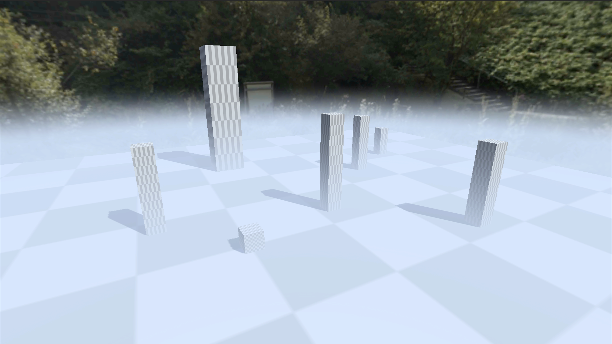

Screen-Space Height + Distance Fog (URP RenderFeature)
===

This project implements a **mobile-optimized Screen-Space Height + Distance Fog** effect as a **URP RenderFeature**.  
It combines height-based and distance fog in a single full-screen pass with **minimal GPU and memory overhead**, designed for real-time use on mid-range Android and iOS devices.

For more implementation details read [DESCRIPTION.md](DESCRIPTION.md)

[download video](./Pictures/preview.mp4)

https://github.com/user-attachments/assets/faa40a9c-0a58-44a4-9807-0e63a94a4ee1

License
-------
This project is MIT License - see the [LICENSE](LICENSE) file for details
