# Screen-Space Height + Distance Fog - Technical Report
## Executive Summary
Implemented a mobile-optimized URP RenderFeature for combined height and distance fog with minimal performance overhead (~2.3ms GPU on mid-range devices). The solution uses a single full-screen pass with adaptive blending strategies based on GPU architecture.

**Unity Version:** 6.0.59f1 (upgraded from 6.0.56f1 due to security vulnerabilities)<br>
**URP Version:** 17.0.4<br>
**Target Devices:** Nothing CMF Phone 2 Pro, Samsung Galaxy S21 FE 5G<br>


### Main points:
- I have chosen Unity 6.0.59f1 instead of 6.0.56f1 because of security vulnerability.
- The `HeightFogFeature` pass is injected at `RenderPassEvent.BeforeRenderingTransparents`.
- Feature is using URP's DepthCopy `_CameraDepthTexture` for fog calculation, and ColorCopy `_CameraOpaqueTexture` for blending.
- For some chips instead of direct AlphaBlend mode, I'm using manual blending with `_CameraOpaqueTexture`, that gives slightly better results.

---

### Component Structure

1. **HeightFogFeature** (RenderFeature)
2. **HeightFogPass** (ScriptableRenderPass)
    - Executes single full-screen fog calculation
    - Uses existing URP depth and color buffers
3. **HeightFog.shader** (HLSL)
    - Exponential fog density calculation
    - Optimized intersection math with fog volume
    - Two blending modes: Manual and Hardware AlphaBlend
4. **HeightFogSettings** (VolumeComponent)
   - **Color** (Color) - Base fog tint
   - **Density** (float) - Overall fog density multiplier
   - **Distance** (float) - Max fog view distance from camera
   - **Height** (float) - Upper plane fog boundary
   - **Height Intensity** (float) - Vertical gradient strength

## Pipeline Integration

### Injection Point: `RenderPassEvent.BeforeRenderingTransparents`
**Rationale:**
1. **Depth Buffer Access:** At this point, all opaque and AlphaTest geometry has been rendered, providing complete `_CameraDepthTexture`
2. **Color Buffer Availability:** URP's `_CameraOpaqueTexture` is available after Skybox pass, allowing manual blending
3. **UI Preservation:** HUD/UI elements rendered in overlay mode remain unaffected as they render after this event. WorldSpace UI should be rendered after Fog or before, with stencil write.
4. **Performance Trade-off:** Single pass before transparents is cheaper than per-object fog in shaders

**Visual Impact:**
- ✅ Fog correctly applies to all opaque geometry and skybox
- ✅ UI/HUD elements remain fog-free
- ⚠️ Transparent objects do NOT receive fog (documented limitation)

### Alternative Approaches Considered

| Approach                                    | Pros                           | Cons                                     | Decision       |
|---------------------------------------------|--------------------------------|------------------------------------------|----------------|
| Current: Single pass before transparents    | Minimal cost, clean opaque fog | No transparency support                  | ✅ **Selected** |
| Per-object fog                              | Transparency support           | More costly and has blending artefacts   | ❌ Rejected     |
| Dual-depth buffer (_FogDensity_MinMaxDepth) | Transparency support           | More costly and require ~+10MB of memory | ❌ Rejected     |

---

## Buffer Management and Resource Lifecycle
### Temporary Buffers: **NONE**
The implementation uses **zero custom intermediate buffers**. All required data comes from URP's pipeline:
- Depth: `_CameraDepthTexture` (created by URP DepthCopy pass)
- Color: `_CameraOpaqueTexture` (created by URP ColorCopy pass)

---

## Full-Screen Copies and RT Switches

### Count: **0 additional copies, 0 additional RT switches**
**Breakdown:**
- **Existing URP copies** (not added by fog):
    - DepthCopy → `_CameraDepthTexture` (required by URP for depth testing)
    - ColorCopy → `_CameraOpaqueTexture` (required for manual blending)
- **FogPass operations:**
    - 1 full-screen draw directly to camera target (no copy)
    - 0 RT switches (renders to already active target)

**Optimization Notes:**
- Manual blending mode requires `_CameraOpaqueTexture`, but if this buffer is in use in RenderPipeline, additional cost is already paid
- On devices where hardware AlphaBlend is efficient (Adreno GPUs), we use it to skip color buffer access entirely
- Tested low-resolution rendering with upscaling (+2 buffers, +1 copy) but measured performance was **worse** due to upscale quality issues and additional memory bandwidth


## Blending Strategy: Platform-Adaptive
### Problem
Different mobile GPU architectures show different performance characteristics for blending operations:

| GPU Family      | Hardware AlphaBlend  | Manual Blend             |  Winner  |
|-----------------|----------------------|--------------------------|----------|
| Mali (G615 MC2) | Slower               | **Faster** (~0.3ms gain) | Manual   |
| Adreno (660)    | **Faster**           | Slower (~0.2ms loss)     | Hardware |

---

## Fog Calculation Details

### Mathematical Model
The math for fog shader is quite simple: compute CameraRay vs FogVolume intersection thickness, and use `exp2(-thickness)` or `1/(1+thickness)`
for computing transmittance. This math is mostly optimized, and split in to factors:
thicknessFactor that counts only fog distance and separate heightFactor that counts only reconstructed from depth positionWS.z.
This to factors multiplied into final fog density.

### Optimization Notes
- Single texture sample for depth (position reconstructed from depth + screen UV)
- Uses `1/(1+x)` or `exp2(-x)` for fast density calculation on mobile GPUs
- Optimized matrix multiplication in vertex pass for `viewDirectionVS`
- Early exit when camera is above fog and ray misses fog volume by distance

---

## Alternative rendering optimizations (low-res rendering)

One of ideas, that come naturally, is to render in smaller target, and upscale after - that makes main fog calculation chipper.
This approach requires two new low-res buffer: `_MaxSceneDepth` and `_FogDensity_MaxDepth`. This targets can be really small (ex. 1/4 of frame buffer), 
but still adds memory footprint and preparing them, also adds computation cost.<br>
And also there is a cost of Depth-Guided Upscaling (at least 5 texture samples in full resolution), 
that often presents visual bugs around 'thin' depth pixels ('cus of loss of detalization in DepthBuffer after downscale).<br>

There is an improvement to this approach is to use `_MinMaxSceneDepth` and `_FogMinMaxDensity_MinMaxDepth`, 
compute two fog vales at the same time and then using more data for upscaling will reduce visual artefacts.<br>
But this will increase memory bandwidth on fog rendering step and after on upscale step.

Earlier iterations on this approach gives worse performance results and I've decided not to move feather in that direction.

---

### Test Results:

#### Nothing SMF Phone 2 Pro [[GSM Arena](https://www.gsmarena.com/nothing_cmf_phone_2_pro_5g-13821.php)]
```yaml
OS: Android 15
Resolution: 1080 x 2392
SoC: Mediatek Dimensity 7300 Pro (4 nm)
CPU: Octa-core (4x2.5 GHz Cortex-A78 & 4x2.0 GHz Cortex-A55)
GPU: Mali-G615 MC2
Benchmarks:
- AnTuTu 10: 683318
- GeekBench 6: Multi-core: 2963 | Single-core: 1013
```

|                                | Fog Off  | Fog On    | Fog Time |
|--------------------------------|----------|-----------|----------|
| GPU frame time                 | ~8.545ms | ~10.550ms | ~2.004ms |
| CPU frame time                 | ~1.875ms | ~2.261ms  | ~0.386ms |
| HeightFogPass (ProfilerMarker) | -        | -         | ~3.794ms | 
| HeightFogPass (RenderDoc)      | -        | -         | ~1.514ms |

Memory:
- `_CameraDepthTexture_2392x1080_R32_SFloat_Tex2D` : ~9.85MB (10333440B)
- `_CameraColorAttachmentA_2392x1080_B10G11R11_UFloatPack32_Tex2D` : ~9.85MB (10333440B)

<details>
<summary>Screenshots</summary>
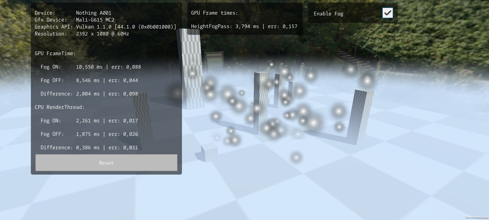
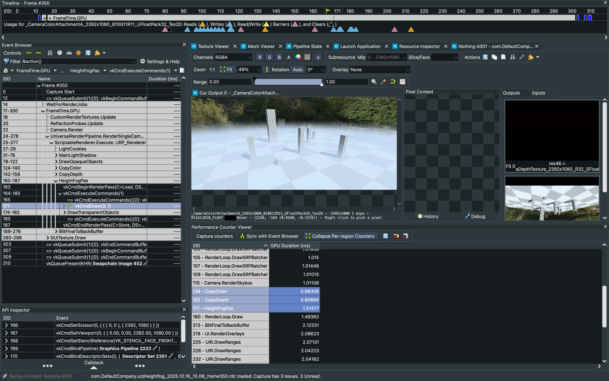
</details>

**Samsung Galaxy S21 FE 5G** [[GSM Arena](https://www.gsmarena.com/samsung_galaxy_s21_fe_5g-10954.php)]
```yaml
OS: Android 15
Resolution: 1080 x 2340 
SoC: Qualcomm SM8350 Snapdragon 888 5G (5 nm) 
CPU: Octa-core (1x2.84 GHz Cortex-X1 & 3x2.42 GHz Cortex-A78 & 4x1.80 GHz Cortex-A55)
GPU: Adreno (TM) 660
Benchmarks:
- AnTuTu: 566529 (v8), 719696 (v9)
- GeekBench: 3049 (v5.1)
```

|                                | Fog Off  | Fog On   | Fog Time |
|--------------------------------|----------|----------|----------|
| GPU frame time                 | ~2,258ms | ~4,832ms | ~2,574ms |
| CPU frame time                 | ~1,831ms | ~1,504ms | ~0,326ms |
| HeightFogPass (ProfilerMarker) | -        | -        | ~0,942ms |
| HeightFogPass (RenderDoc)      | -        | -        | ~0.921ms |

Memory:
- `_CameraDepthTexture_2340x1080_R32_SFloat_Tex2D` : ~9.64MB (10108800B)
- `_CameraColorAttachmentA_2340x1080_B10G11R11_UFloatPack32_Tex2D` : ~9.64MB (10108800B)

<details>
<summary>Screenshots</summary>
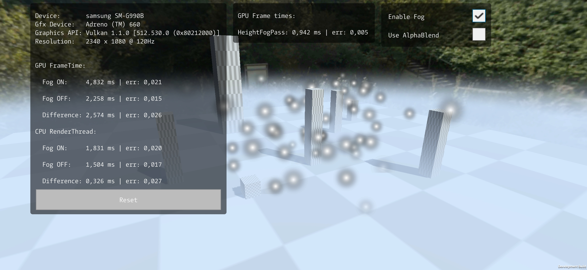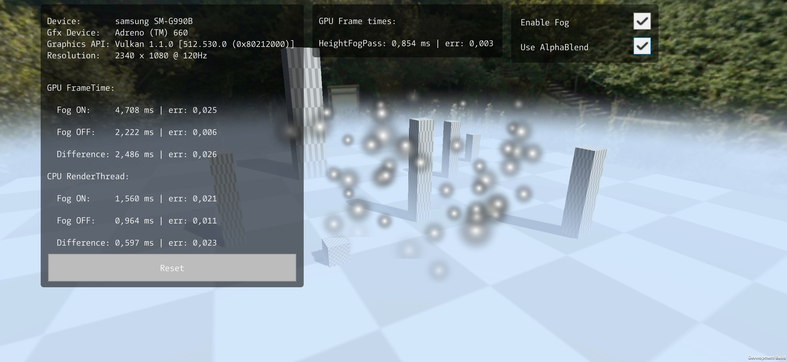
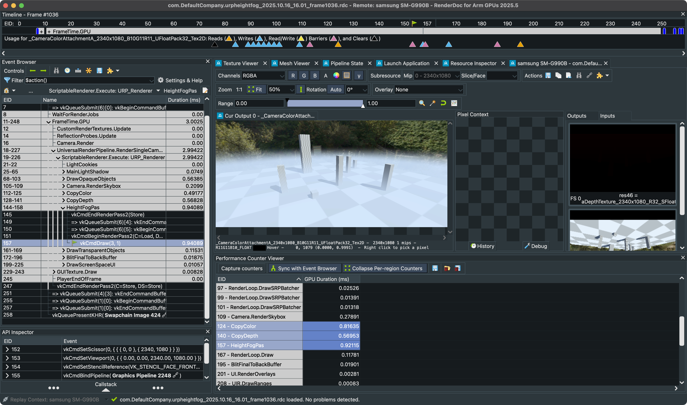
</details>

**Honor 400** [[GSM Arena](https://www.gsmarena.com/honor_400_5g-13799.php)]
```yaml
OS: Android 15
Resolution: 1264 x 2736 pixels
SoC: Qualcomm SM7550-AB Snapdragon 7 Gen 3 (4 nm)
CPU: Octa-core (1x2.63 GHz Cortex-A715 & 3x2.4 GHz Cortex-A715 & 4x1.8 GHz Cortex-A510)
GPU: Adreno 720
Benchmarks:
- AnTuTu: 864286 (v10)
- GeekBench: 3198 (v6)
```

|                                | Fog Off  | Fog On   | Fog Time |
|--------------------------------|----------|----------|----------|
| GPU frame time                 | ~6.033ms | ~7.098ms | ~1.065ms |
| CPU frame time                 | ~1.478ms | ~1.912ms | ~0.434ms |
| HeightFogPass (ProfilerMarker) | -        | -        | ~2.021ms |

Memory:
- `_CameraDepthTexture_2736x1264_R32_SFloat_Tex2D` : ~13.19MB (13833216B)
- `_CameraColorAttachmentA_2736x1264_B10G11R11_UFloatPack32_Tex2D` : ~13.19MB (13833216B)

<details>
<summary>Screenshots</summary>
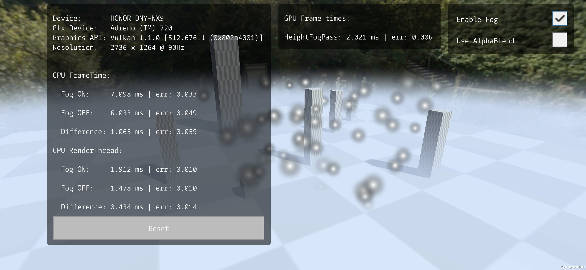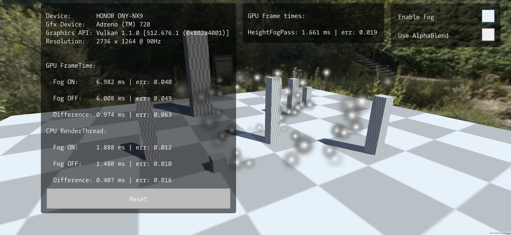
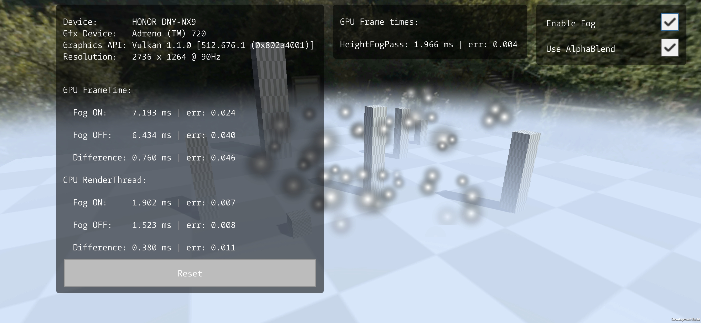
</details>

**Apple iPad 10.2 (2021)**
```yaml
OS: iPadOS 18.6.2
Resolution: 1620 x 2160
SoC: Apple A13 Bionic (7 nm+)
CPU: Hexa-core (2x2.65 GHz Lightning + 4x1.8 GHz Thunder)
GPU: Apple GPU (4-core graphics)
Benchmarks:
- AnTuTu: 617292(v9)
- GeekBench: 3124 (v5.1)
```

|                       | Fog Off  | Fog On   | Fog Time |
|-----------------------|----------|----------|----------|
| GPU frame time        | ~3,784ms | ~6,455ms | ~2,671ms |
| CPU frame time        | ~1,804ms | ~1,967ms | ~0,163ms |
| HeightFogPass (XCode) | -        | -        | ~0.952ms |

Memory:
- `_CameraDepthTexture_2160x1620_R32_SFloat_Tex2D` : ~13.35MB (13996800B)
- `_CameraColorAttachmentA_2160x1620_B10G11R11_UFloatPack32_Tex2D` : ~13.35MB (13996800B)

<details>
<summary>Screenshots</summary>
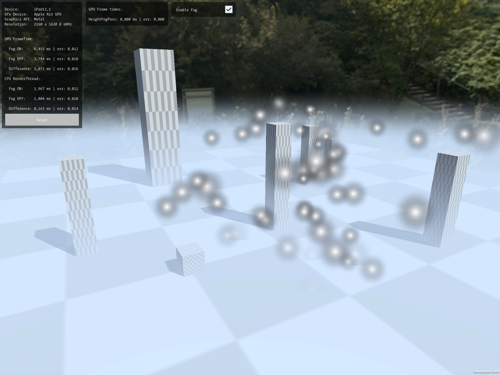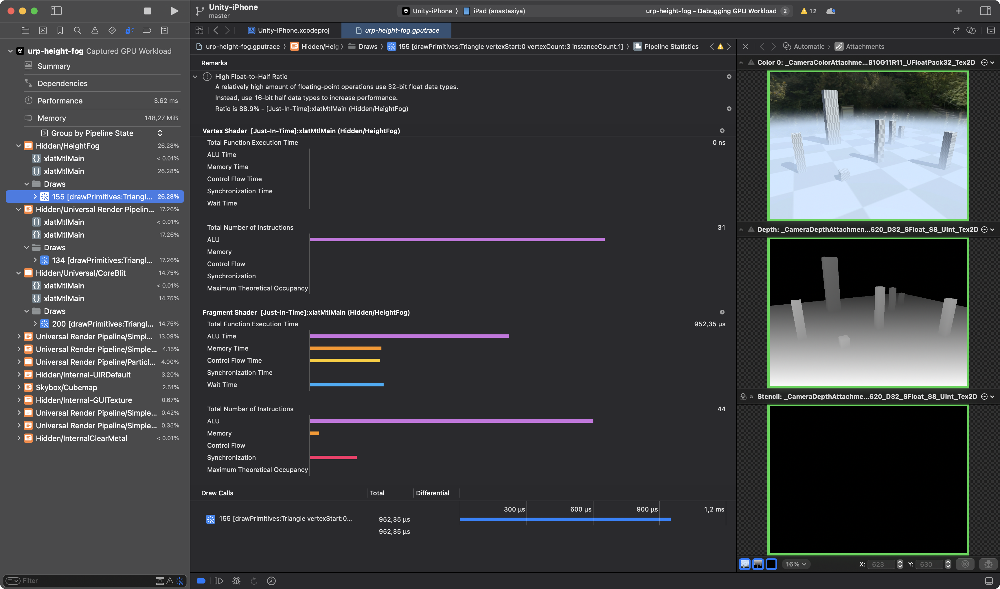
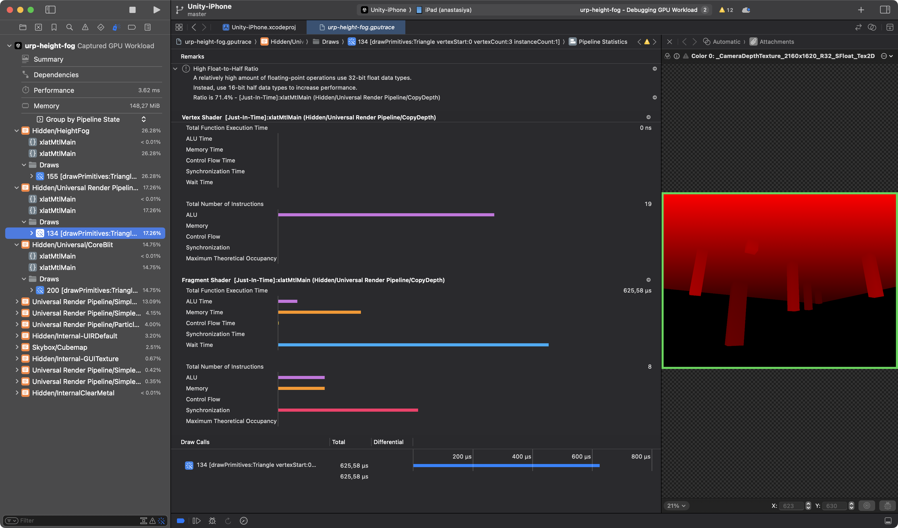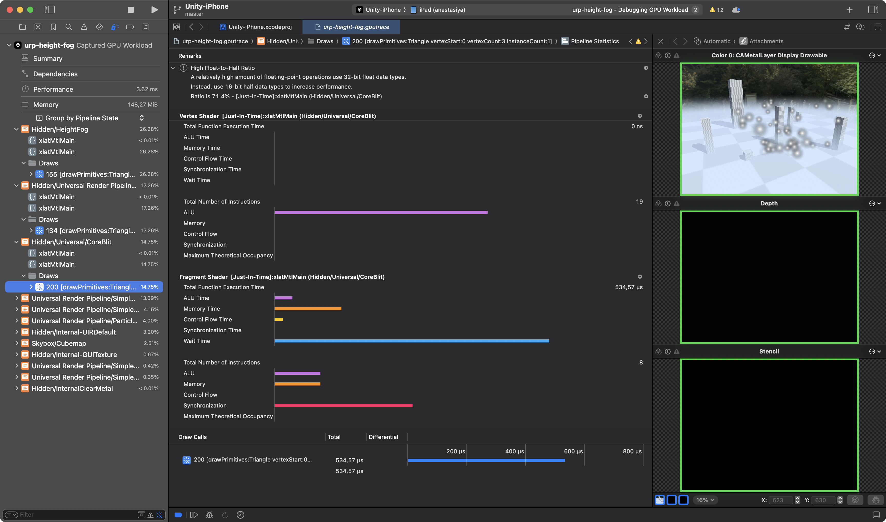
</details>

---

## MaliOC report for `HeightFog.shader` fragment:
```yaml
Mali Offline Compiler v8.8.0 (Build 888cd7)
Copyright (c) 2007-2025 Arm Limited. All rights reserved.

Configuration
=============

Hardware: Mali-G1 r0p1
Architecture: Arm 5th Generation
Driver: r55p0-00rel0
Shader type: Vulkan Fragment

Main shader
===========

Work registers: 13 (40% used at 100% occupancy)
Uniform registers: 16 (12% used)
Stack use: false
16-bit arithmetic: 25%
 - Idle SIMD lanes: 30%

                                A     FMA     CVT     SFU      LS       V       T    Bound
Total instruction cycles:    0.27    0.19    0.05    0.25    0.00    0.06    0.25        A
Shortest path cycles:        0.19    0.08    0.05    0.19    0.00    0.06    0.25        T
Longest path cycles:         0.27    0.19    0.05    0.25    0.00    0.06    0.25        A

A = Arithmetic, FMA = Arith FMA, CVT = Arith CVT, SFU = Arith SFU,
LS = Load/Store, V = Varying, T = Texture

Shader properties
=================

Has uniform computation: true
Has side-effects: false
Modifies coverage: false
Uses late ZS test: false
Uses late ZS update: false
Reads color buffer: false
```

---

<details>
<summary>Draft</summary>

## Details:
### Queue and Transparency
The fog rendered in one DrawCall at `RenderPassEvent.BeforeRenderingTransparents` as a full screen effect, 
right after `Skybox` and before `Transparents` pass.
The pass uses Queue to be able to use DepthCopy and ColorCopy buffers, that made after Opaque and AlphaTest geometry. 
With such queue, the feature doesn't properly interact with Transparent geometry.

Alternative solution to support Transparent geometry, it is moving fog calculation into Transparent shader,
but it will be more costly and AlphaBlend still will present more visual issues.<br>
Another way is storing separate `_FogBackDepth` buffer of fog far surface and depending on distance to it, apply fog by normalized distance,
but it will also present separate `_FogDensity` buffer and increase feature cost.<br>
I decided to keep it simple, just to render it in one pass, without presenting additional buffers, but sacrifice Transparent geometry.

### Fog evaluation
The math for fog shader is quite simple: compute CameraRay vs FogVolume intersection thickness, and use `exp2(-thickness)`
for computing transmittance. This math is mostly optimized, and split in to factors:
thicknessFactor that counts only fog distance and separate heightFactor that counts only reconstructed from depth positionWS.z.
This to factors multiplied into final fog density.

### Applying of the fog
For rendering/blending fog into the scene, I've tested several solutions:
- Manual AlphaBlend in fog shader - gives good result, but requires `CopyColor`, if it's already presented, the cast already paid and we good to go. 
- `AlphaBlend SrcAlpha OneMinusSrcAlpha` in fog shader - gives good result, it performs worse on `Mali-G615 MC2` but better on `Adreno (TM) 660`.
- Render in smaller target, and upscale after - this makes main shader chipper, but adds memory overhead of two new low-res buffer: 
`_MaxSceneDepth` and `_FogDensity_MaxDepth`. And also adds cost of depth-guided upscaling (5 texture samples), 
which often presents visual bugs around thing objects or holes.<br>
There is an improvement to this approach is to use `_MinMaxSceneDepth` and `_FogMinMaxDensity_MinMaxDepth`, compute two fog vales at the same time and 
then using more data for upscaling will reduce visual artefacts.<br>
But earlier iterations on this approach gives worse performance.

So I decided to keep both variants: `Manual Blend` and `AlphaBlend`, but use it depending on the running device. 

---

</details>
