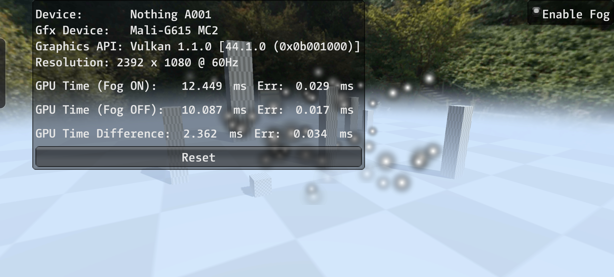

### Main points:
- I have chosen Unity 6.0.59f1 instead of 6.0.56f1 because of security vulnerability.
- The `HeightFogFeature` pass is injected at `RenderPassEvent.BeforeRenderingTransparents`.
- Feature is using URP's DepthCopy `_CameraDepthTexture` for fog calculation, and ColorCopy `_CameraOpaqueTexture` for blending.
- Instead of using direct AlphaBlend mode in shader, I'm using manual blending with `_CameraOpaqueTexture`, that gives slightly better results on Mali chip.

## Details:
### Queue and Transparency
The fog rendered in one DrawCall at `RenderPassEvent.BeforeRenderingTransparents` as a full screen effect, 
right after `Skybox` and before `Transparents` pass.
The pass uses Queue to be able to use DepthCopy and ColorCopy buffers, that made after Opaque and AlphaTest geometry. 
With such queue, the feature doesn't properly interact with Transparent geometry.

Alternative solution to support Transparent geometry, it is moving fog calculation into Transparent shader,
but it will be more costly and AlphaBlend still will present more visual issues.<br>
Another way is storing separate `_FogBackDepth` buffer of fog far surface and depending on distance to it, apply fog by normalized distance,
but it will also present separate `_FogDensity` buffer and increase feature cost.<br>
I decided to keep it simple, just to render it in one pass, without presenting additional buffers, but sacrifice Transparent geometry.

### Fog evaluation
The math for fog shader is quite simple: compute CameraRay vs FogVolume intersection thickness, and use `exp2(-thickness)`
for computing transmittance. This math is mostly optimized, and split in to factors:
thicknessFactor that counts only fog distance and separate heightFactor that counts only reconstructed from depth positionWS.z.
This to factors multiplied into final fog density.

### Applying of the fog
For rendering/blending fog into the scene, I've tested several solutions:
- Manual AlphaBlend in fog shader - gives good result, but requires `CopyColor`, if it's already presented, the cast already paid and we good to go. 
- `AlphaBlend SrcAlpha OneMinusSrcAlpha` in fog shader - gives good result, it performs worse on `Mali-G615 MC2` but better on `Adreno (TM) 660`.
- Render in smaller target, and upscale after - this makes main shader chipper, but adds memory overhead of two new low-res buffer: 
`_MaxSceneDepth` and `_FogDensity_MaxDepth`. And also adds cost of depth-guided upscaling (5 texture samples), 
which often presents visual bugs around thing objects or holes.<br>
There is an improvement to this approach is to use `_MinMaxSceneDepth` and `_FogMinMaxDensity_MinMaxDepth`, compute two fog vales at the same time and 
then using more data for upscaling will reduce visual artefacts.<br>
But earlier iterations on this approach gives worse performance.

So I decided to keep both variants: `Manual Blend` and `AlphaBlend`, but use it depending on the running device. 

---

### Test Devices:
#### Nothing SMF Phone 2 Pro [[GSM Arena](https://www.gsmarena.com/nothing_cmf_phone_2_pro_5g-13821.php)]
```yaml
OS: Android 15
Chipset: Mediatek Dimensity 7300 Pro (4 nm)
CPU:     Octa-core (4x2.5 GHz Cortex-A78 & 4x2.0 GHz Cortex-A55)
GPU:     Mali-G615 MC2
Benchmarks:
- AnTuTu 10: 683318
- GeekBench 6: Multi-core: 2963 | Single-core: 1013
```

Times:


|                 | Fog Off   | Fog On    | Fog time |
|-----------------|-----------|-----------|----------|
| GPU frame time: | ~10.087ms | ~12.449ms | ~2.363ms |
| CPU frame time: |           |           |          |

Memory:
- `_CameraDepthTexture_2392x1080_R32_SFloat_Tex2D` : ~9.85MB (10333440B)
- `_CameraColorAttachmentA_2392x1080_B10G11R11_UFloatPack32_Tex2D` : ~9.85MB (10333440B)

**Samsung Galaxy S21 FE 5G** [[GSM Arena](https://www.gsmarena.com/samsung_galaxy_s21_fe_5g-10954.php)]
```yaml
Chipset: Qualcomm SM8350 Snapdragon 888 5G (5 nm) 
CPU:     Octa-core (1x2.84 GHz Cortex-X1 & 3x2.42 GHz Cortex-A78 & 4x1.80 GHz Cortex-A55)
GPU:     Adreno (TM) 660
Benchmarks:
- AnTuTu: 566529 (v8), 719696 (v9)
- GeekBench: 3049 (v5.1)
```

|                 | Fog Off   | Fog On    | Fog time |
|-----------------|-----------|-----------|----------|
| GPU frame time: | ~10.087ms | ~12.449ms | ~2.363ms |
| CPU frame time: |           |           |          |

Memory:
- `_CameraDepthTexture_2392x1080_R32_SFloat_Tex2D` : ~9.85MB (10333440B)
- `_CameraColorAttachmentA_2392x1080_B10G11R11_UFloatPack32_Tex2D` : ~9.85MB (10333440B)


## MaliOC report for `HeightFog.shader` fragment:
```yaml
Mali Offline Compiler v8.8.0 (Build 888cd7)
Copyright (c) 2007-2025 Arm Limited. All rights reserved.

Configuration
=============

Hardware: Mali-G1 r0p1
Architecture: Arm 5th Generation
Driver: r55p0-00rel0
Shader type: Vulkan Fragment

Main shader
===========

Work registers: 13 (40% used at 100% occupancy)
Uniform registers: 16 (12% used)
Stack use: false
16-bit arithmetic: 25%
 - Idle SIMD lanes: 30%

                                A     FMA     CVT     SFU      LS       V       T    Bound
Total instruction cycles:    0.27    0.19    0.05    0.25    0.00    0.06    0.25        A
Shortest path cycles:        0.19    0.08    0.05    0.19    0.00    0.06    0.25        T
Longest path cycles:         0.27    0.19    0.05    0.25    0.00    0.06    0.25        A

A = Arithmetic, FMA = Arith FMA, CVT = Arith CVT, SFU = Arith SFU,
LS = Load/Store, V = Varying, T = Texture

Shader properties
=================

Has uniform computation: true
Has side-effects: false
Modifies coverage: false
Uses late ZS test: false
Uses late ZS update: false
Reads color buffer: false
```
